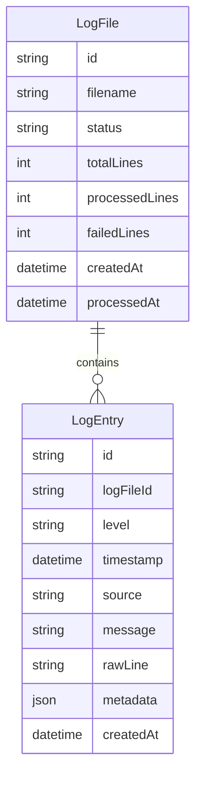
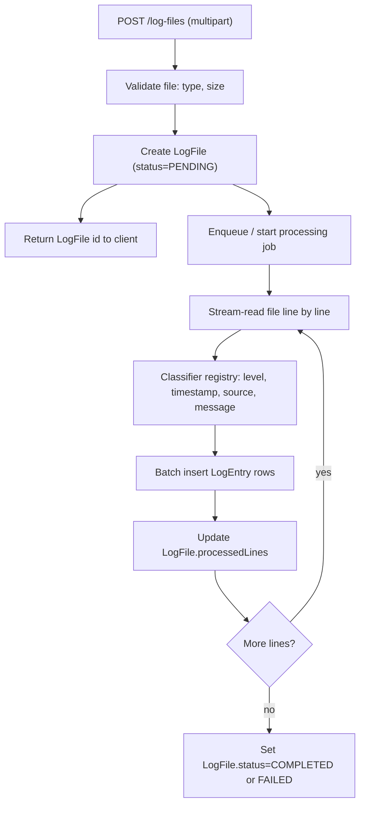

# Product Requirements Document: Log Analysis Platform

## 1. Overview

### 1.1 Context

Modern systems generate thousands of log records daily for monitoring, auditing, failure diagnosis, and operations tracking. The ability to quickly analyze this data is essential for identifying problems, detecting patterns, and supporting decision-making.

### 1.2 Objective

Build a backend service capable of importing log files, processing and classifying their records, storing them in a structured way, and exposing mechanisms for querying, filtering, searching, and statistically visualizing the data through a REST API.

### 1.3 Scope of this document

This PRD covers a **backend-only** implementation, built on top of the existing NestJS (Fastify) + Prisma + PostgreSQL Clean Architecture template in this repository. There is intentionally **no frontend** and **no authentication** in scope (see [Section 2.2](#22-non-goals)). The original challenge's "responsive table", "infinite scroll", and "dashboard with charts" requirements are reframed as **paginated and analytical REST endpoints** that any client (a future SPA, a CLI, or an evaluator's HTTP client / Swagger UI) can consume.

## 2. Scope

### 2.1 In scope

- Import of log files (upload endpoint).
- Automatic parsing and classification of log records (level, timestamp, source, message).
- Structured, indexed storage in PostgreSQL via Prisma.
- Querying logs with filters (level, date range, free-text content) and pagination.
- Cursor-based pagination / infinite scroll support for large volumes.
- Dashboard-style analytical endpoints: counts by level, time-bucketed trends, top sources, distribution of events.
- Error handling and validation for malformed files, malformed lines, and invalid query params.
- Docker Compose setup for local execution (API + Postgres + Redis).
- API documentation via Swagger (already wired in the template) and a README with execution instructions.

### 2.2 Non-goals

- No frontend/UI. All "visualization" requirements are satisfied by API responses shaped for charting (e.g., pre-aggregated time series), not by rendered charts.
- No authentication/authorization. All endpoints operate in a single shared space; there is no per-user scoping of log files or entries. The template's `users` / `auth` module has been removed entirely rather than left unwired.
- No real-time streaming ingestion (e.g., log tailing, syslog receivers, Kafka). Import is file-based and batch-oriented.
- No alerting/notification system.
- No multi-tenancy.

## 3. Personas & User Stories

**Persona: Operations / SRE engineer (API consumer)**

- As an engineer, I want to upload a log file so that its records are parsed, classified, and stored for analysis.
- As an engineer, I want to check the processing status of an uploaded file so that I know when it is safe to query its records.
- As an engineer, I want to list log entries with filters by level, date range, and free-text search so that I can investigate a specific incident.
- As an engineer, I want paginated/cursor-based access to log entries so that browsing large files stays fast and responsive.
- As an engineer, I want aggregate statistics (counts by level, error trends over time, top sources) so that I can quickly spot anomalies without reading every record.
- As an engineer, I want clear error messages when a file is malformed or a query is invalid so that I can correct my request.

## 4. Functional Requirements

Mapped to the challenge's "Expected Features":

| # | Challenge requirement | Implementation |
|---|---|---|
| 1 | Import of log files | `POST /log-files` multipart upload, size-limited, accepted formats validated |
| 2 | Automatic processing and classification | Streaming parser + classifier registry, run synchronously for small files / asynchronously (queued) for large ones |
| 3 | Structured storage | `LogFile` + `LogEntry` Prisma models, batch-inserted |
| 4 | Querying logs in a responsive table | `GET /logs` returns paginated JSON rows sized for table rendering |
| 5 | Filters by level, date, content | Query params `level`, `from`/`to`, `q` (text) on `GET /logs` |
| 6 | Text search | Postgres full-text search (`tsvector` + GIN) or trigram `ILIKE` on `message`/`rawLine` |
| 7 | Infinite scroll / optimized pagination | Cursor-based pagination (`cursor`, `limit`) in addition to offset pagination |
| 8 | Dashboard with indicators and charts | `GET /dashboard/summary`, `GET /dashboard/trends` return pre-aggregated numbers/series |
| 9 | Visualization of trends and distribution | Time-bucketed series (hourly/daily) and level-distribution breakdowns in the dashboard endpoints |

### 4.1 Log import

- Accepts `.log`, `.txt`, and `.jsonl`/`.json` (line-delimited JSON logs) files via multipart upload.
- Validates file presence, MIME type, and a configurable max size (e.g., 50 MB) before accepting.
- Creates a `LogFile` record immediately with status `PENDING`, returns its `id` so the client can poll for status.
- Processing transitions the file through `PENDING -> PROCESSING -> COMPLETED | FAILED`, tracking `totalLines`, `processedLines`, and `failedLines`.
- Lines that cannot be parsed/classified are counted as failures and optionally retained with a `raw` classification rather than dropped, so no data is silently lost.

### 4.2 Classification

- A **classifier registry** (a map of named strategies, not nested ternaries, per repo conventions) attempts, in order:
  1. Structured JSON line parsing (looks for `level`/`severity`, `timestamp`, `message` keys).
  2. Common plain-text patterns (e.g., `[2024-01-01T10:00:00Z] ERROR message...`, syslog-like `<priority>timestamp host tag: message`).
  3. Fallback heuristic: detect a level keyword (`ERROR`, `WARN`, `INFO`, `DEBUG`, `TRACE`, `FATAL`) anywhere in the line; default to `UNKNOWN` if none found.
- Extracted fields: `level`, `timestamp` (defaults to file-import time if unparseable), `source` (service/host token if present), `message`, `rawLine` (always preserved), `metadata` (JSON blob for any extra structured fields).

### 4.3 Querying & filtering

`GET /logs` supports:
- `level`: exact match or comma-separated list (e.g., `ERROR,FATAL`).
- `from`, `to`: ISO 8601 timestamp bounds.
- `q`: free-text search against `message`/`rawLine`.
- `logFileId`: restrict to a single imported file.
- `cursor` + `limit`: cursor-based pagination for infinite scroll (primary mode for large volumes).
- `page` + `pageSize` + `order`: offset-based pagination, reusing the existing `PaginationParams`/`PaginatedItems` types, for callers that need total counts/page numbers.

### 4.4 Dashboard / analytics

- `GET /dashboard/summary`: total entries, counts per level, count of distinct sources, count of files processed.
- `GET /dashboard/trends?bucket=hour|day&from=&to=`: time-bucketed counts, optionally split by level, ready to feed a chart's x/y series.
- `GET /dashboard/top-sources`: top N sources/services by volume or by error rate.
- All dashboard endpoints are cacheable (Redis, via the existing `ioredis` dependency) with short TTLs, since they are read-heavy and recompute-expensive at scale.

## 5. Data Model

- `LogFile.status`: `PENDING | PROCESSING | COMPLETED | FAILED`.
- `LogEntry.level`: `TRACE | DEBUG | INFO | WARN | ERROR | FATAL | UNKNOWN`.
- Indexes: `LogEntry(logFileId)`, `LogEntry(level, timestamp)`, `LogEntry(timestamp)`, GIN index on the search vector (or trigram index on `message`).
- `LogEntry.id` uses a sortable identifier (e.g., ULID/cuid or `(timestamp, id)` composite) so cursor pagination is stable and efficient without `OFFSET`.

## 6. API Surface

| Method | Path | Purpose |
|---|---|---|
| `POST` | `/log-files` | Upload a log file, returns `LogFile` with status `PENDING` |
| `GET` | `/log-files` | List imported files (paginated), with status/progress |
| `GET` | `/log-files/:id` | Get a single file's processing status/summary |
| `GET` | `/logs` | List/filter/search log entries (cursor or offset pagination) |
| `GET` | `/logs/:id` | Get a single log entry by id |
| `GET` | `/dashboard/summary` | Aggregate indicators (counts by level, sources, files) |
| `GET` | `/dashboard/trends` | Time-bucketed series for trend charts |
| `GET` | `/dashboard/top-sources` | Ranked sources/services by volume or error rate |

All endpoints are documented via `@nestjs/swagger` decorators, consistent with existing controllers (e.g., [get-log-entry-by-id.controller.ts](../src/infra/http/presentation/controllers/get-log-entry-by-id/get-log-entry-by-id.controller.ts)), and validated with Zod DTOs via [ZodValidationPipe](../src/infra/http/presentation/pipes/zod-validation.pipe.ts).

## 7. Architecture

### 7.1 Layering

Follows the existing Clean Architecture layout:

- `domain/enterprise/entities`: `LogFile`, `LogEntry` entities implementing the shared [Entity](../src/core/domain/entity.ts) base.
- `domain/application/repositories`: `LogFilesRepository`, `LogEntriesRepository` as `type + Symbol` pairs (see [log-files.repository.ts](../src/domain/application/repositories/log-files.repository.ts)).
- `domain/application/usecases`: `ImportLogFileUseCase`, `ProcessLogFileUseCase`, `ListLogEntriesUseCase`, `GetLogFileByIdUseCase`, `GetDashboardSummaryUseCase`, `GetDashboardTrendsUseCase`, each implementing [UseCase](../src/core/domain/application/use-case.ts).
- `infra/persistence/repositories/prisma`: Prisma implementations of the above repositories, registered in [RepositoriesModule](../src/infra/persistence/repositories/repositories.module.ts).
- `infra/http/presentation/controllers`: one controller per endpoint group (`log-files`, `logs`, `dashboard`), following the one-class-per-file rule.
- `infra/log-processing` (new): the file parser, the classifier registry, and (optionally) a queue consumer.

### 7.2 Processing flow

### 7.3 Synchronous vs. background processing

- For files below a configurable size/line-count threshold, processing runs inline within the upload request for simplicity.
- For larger files, processing is deferred to a background job so the upload request returns immediately with `PENDING` status. Given `ioredis` is already a dependency, `BullMQ` is the natural choice for the queue; if kept out of scope for time reasons, an in-process `setImmediate`/async-queue fallback is acceptable for the challenge's evaluation scale.

### 7.4 New dependencies required

- `@fastify/multipart`: multipart file upload support (not currently a dependency; the template only has `@fastify/compress`, `@fastify/cors`, `@fastify/helmet`).
- `bullmq` (optional): background job queue, reusing the existing Redis connection.
- No changes needed to the ORM/DB choice — Prisma + PostgreSQL already fit structured storage and indexing needs.

## 8. Non-Functional Requirements

### 8.1 Performance

- Streaming file parsing (never load the whole file into memory).
- Batched inserts (e.g., 1,000 rows per `createMany`) instead of row-by-row writes.
- Cursor-based pagination as the default for `GET /logs` to avoid expensive `OFFSET` scans at scale.
- Composite indexes on `(level, timestamp)` and a search index (`GIN`) to keep filtering and text search fast as volume grows.
- Redis caching of dashboard aggregates with short TTL and cache invalidation (or simply TTL expiry) on new imports.

### 8.2 Error handling & validation

- Zod schemas validate all request DTOs (query params, path params, upload metadata), consistent with [zod-validation.pipe.ts](../src/infra/http/presentation/pipes/zod-validation.pipe.ts).
- Domain-specific errors (e.g., `LogFileNotFoundError`, `UnsupportedFileTypeError`, `FileTooLargeError`) extend the existing error patterns (see [resource-not-found.error.ts](../src/shared/application/errors/resource-not-found.error.ts)) and are translated to appropriate HTTP status codes in controllers, mirroring [get-log-file-by-id.controller.ts](../src/infra/http/presentation/controllers/get-log-file-by-id/get-log-file-by-id.controller.ts).
- Malformed individual lines never fail the whole import; they are counted in `failedLines` and, where feasible, stored with `level=UNKNOWN` and the raw content preserved.
- Global exception handling and consistent error response shape reused from the existing Nest setup.

### 8.3 Observability & documentation

- Swagger UI (already configured in [main.ts](../src/main.ts)) documents every new endpoint.
- README updated with: environment setup, `docker compose up`, migration commands, sample `curl` requests for import/query/dashboard endpoints, and sample log files for manual testing.
- Structured logging of processing job outcomes (lines processed, failures, duration) for operational visibility.

### 8.4 Testing

- Unit tests (Vitest) for the classifier registry (one test per format/pattern) and each use case, following existing patterns (e.g., [get-dashboard-summary.usecase.test.ts](../src/domain/application/usecases/get-dashboard-summary/get-dashboard-summary.usecase.test.ts)).
- E2E tests for the controllers (import, list/filter, dashboard), following [list-log-files.controller.e2e-spec.ts](../src/infra/http/presentation/controllers/list-log-files/list-log-files.controller.e2e-spec.ts).

## 9. Milestones

| Milestone | Deliverable |
|---|---|
| M1 | Prisma schema for `LogFile`/`LogEntry`, migrations, repository interfaces + Prisma implementations |
| M2 | Classifier registry + streaming parser, unit-tested against sample log formats |
| M3 | Import endpoint (`POST /log-files`) with sync processing path |
| M4 | Query endpoint (`GET /logs`) with filters, text search, cursor + offset pagination |
| M5 | Dashboard endpoints (`summary`, `trends`, `top-sources`) with Redis caching |
| M6 | Background processing for large files (queue) |
| M7 | Docker Compose finalization, README with execution instructions, E2E test suite, load testing at target volume |

## 10. Mapping to Evaluation Criteria

| Criterion | How this PRD addresses it |
|---|---|
| Code quality and organization | Reuses the repo's Clean Architecture layering, one-class-per-file, no nested ternaries (classifier registry) |
| Solution architecture | Layered domain/application/infra split; clear processing pipeline; documented in Section 7 |
| Project organization | Milestone-based delivery (Section 9); Prisma migrations as source of truth for schema |
| User experience (via API) | Predictable, filterable, paginated API shaped for a future UI; pre-aggregated dashboard data |
| Application performance | Streaming ingestion, batch inserts, indexed queries, cursor pagination, caching (Section 8.1) |
| Good development practices | Zod validation, typed repositories/use cases, unit + e2e tests, ESLint rules already enforced |
| Error handling and validation | Domain errors, per-line failure isolation, validated DTOs (Section 8.2) |
| Documentation and execution instructions | Swagger docs, updated README, sample requests/files (Section 8.3) |

## 11. Out of Scope / Future Work

- Frontend SPA (React) consuming this API: table view, filters UI, charts, infinite scroll.
- Authentication/authorization and per-user/team scoping of log files.
- Real-time ingestion (log shipping agents, syslog/HTTP push, streaming pipelines).
- Alerting/notification rules on anomaly detection.
- Multi-tenancy and role-based access control.
